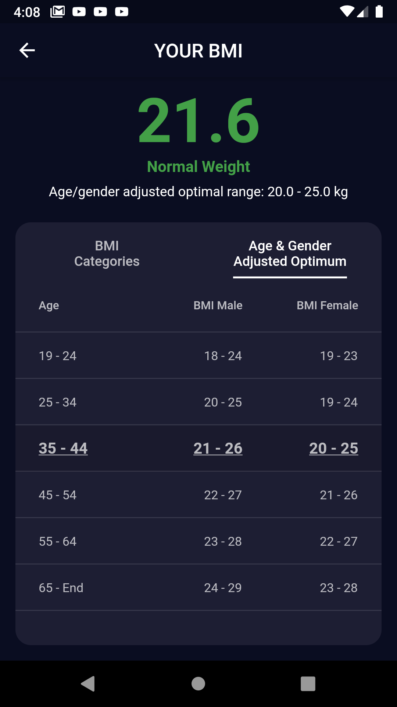

# BMI Calculator

General info about BMI results:
* This app uses BMI categories from [here](https://www.bmi-tabellen.de/).
* For children this does not calculate WHO-conform BMI judgements. Those are based on year and month while the app uses slightly simplified categories based only on the year.

### General
This BMI calculator is based on the design of [Ruben Vaalt](https://dribbble.com/shots/4585382-Simple-BMI-Calculator) on Dribble
with some adjustments:
* Gender icons grow/shrink according to user input (height/width).
* Quicker input: Every input has +/- buttons and a slider. Nobody wants to press a plus-button 40 times.
* Inputs have no title header, but instead use a postfix-label after the number for the unit (kg, years, cm, ...).
* Male/female toggle buttons use a gradient into the background color on the top. Otherwise the growing height of the icon would look bad inside the card (not filled completely in the beginning, potentially not enough space after growing.

**Input screen**

 

**Animation of height and weight**

### State management
* Normally I use Provider or BLoC, but this project is built entirely using setState.

### Technology used
* SVG images with [flutter_svg](https://pub.dev/packages/flutter_svg)
* [Dart extension methods](https://dart.dev/guides/language/extension-methods) for custom ThemeData fields

### Road map
* Support for age/gender specific BMI tables < 19 years.
* Drawer with settings
  * Customizable units.
  * Settings are persistent
* Landscape layout
* Some statistics and general info
* Better visualization of height/weight in input screen

